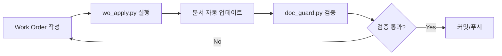

# Work Order 시스템 가이드

**버전**: v0.1.2
**날짜**: 2025-11-02
**상태**: Active

---

## 개요

Work Order는 **모든 작업 지시서를 표준화된 YAML 형식으로 관리**하고, `techspec.md`와 `plan.md`에 **자동으로 반영**하는 시스템입니다.

### 핵심 목표

- **Single Source of Truth (SSoT)**: Work Order가 모든 문서 변경의 원천
- **자동화**: 수동 복사/붙여넣기 없이 스크립트로 일괄 적용
- **일관성**: 버전, 날짜, 상태 자동 동기화
- **추적성**: 모든 변경은 Work Order로 추적 가능

---

## 디렉토리 구조

```
docs/work_orders/
├── README.md                      # 이 파일
├── wo-template.yaml               # 빈 템플릿
├── wo-v0.1.2-gate-a.yaml         # Gate-A Work Order
└── wo-vX.Y.Z-gate-<문자>.yaml    # 향후 Work Orders
```

---

## Work Order 작성 방법

### 1. 템플릿 복사

```bash
cp docs/work_orders/wo-template.yaml docs/work_orders/wo-v0.2.0-gate-b.yaml
```

### 2. 메타데이터 작성

```yaml
meta:
  version: v0.2.0                    # 버전 번호
  date: 2025-11-05                   # 작업 지시 날짜
  status: draft                      # draft | locked | archived
  summary: "Gate-B: ML 모델 통합"    # 한 줄 요약
```

### 3. 문서 패치 정의

#### techspec.md 패치

```yaml
patches:
  techspec:
    - section: "Open Issues"         # AUTOGEN 마커 이름
      mode: append                   # replace | append | ensure
      content: |
        - 새로운 이슈 항목
        - 추가 이슈

    - section: "Security Controls"
      mode: replace                  # 기존 내용을 완전히 교체
      content: |
        새로운 보안 통제 내용...
```

#### plan.md 패치

```yaml
  plan:
    - section: "Milestones"
      mode: replace
      content: |
        W3 Gate-B 마일스톤:
        - ML 모델 통합 완료
        - API 성능 테스트 통과

    - section: "Next Actions"
      mode: replace
      content: |
        Day 10: ML 모델 래퍼 작성
        Day 11: API 엔드포인트 통합
```

### 4. 작업 정의

```yaml
work:
  claude:
    - id: C-10
      title: ML 모델 래퍼 v1
      deliverables:
        - apps/ml/{model_wrapper.py,predictor.py}
      acceptance:
        - 모델 로드 및 추론 성공
        - pytest ≥10, 커버리지 ≥80%

    - id: C-11
      title: API 통합
      deliverables:
        - apps/api/routes/predict.py
      acceptance:
        - /predict 엔드포인트 200 OK
        - 응답 시간 p95 <500ms
```

---

## 패치 모드 설명

### `replace` (교체)

기존 내용을 **완전히 교체**합니다.

```yaml
mode: replace
content: |
  새로운 내용만 남음
```

**사용 예시**: 버전 업데이트 시 전체 섹션 새로 작성

### `append` (추가)

기존 내용 **뒤에 추가**합니다.

```yaml
mode: append
content: |
  - 새 항목 1
  - 새 항목 2
```

**사용 예시**: Open Issues에 신규 이슈 추가

### `ensure` (보장)

섹션이 **비어있을 때만** 채웁니다.

```yaml
mode: ensure
content: |
  기본 내용
```

**사용 예시**: 초기 섹션 생성

---

## Work Order 적용

### 1. 스크립트 실행

```bash
python scripts/wo_apply.py docs/work_orders/wo-v0.2.0-gate-b.yaml
```

### 2. VSCode 태스크 실행

`Ctrl+Shift+P` → "Tasks: Run Task" → `wo:apply`

### 3. 출력 예시

```
Work Order 로드 중: docs\work_orders\wo-v0.2.0-gate-b.yaml
버전: v0.2.0, 날짜: 2025-11-05, 상태: draft
헤더 동기화 중...

techspec.md에 패치 적용 중...
  - 섹션: Open Issues (모드: append)
  - 섹션: Security Controls (모드: replace)

plan.md에 패치 적용 중...
  - 섹션: Milestones (모드: replace)
  - 섹션: Next Actions (모드: replace)

index.md와 CHANGELOG.md 업데이트 중...

[OK] 완료: v0.2.0 (4개 패치 적용)
   - docs\techspec.md
   - docs\plan.md
   - docs\index.md
   - CHANGELOG.md
```

---

## 문서 검증

Work Order 적용 후 **반드시 검증**을 실행하세요.

### 검증 실행

```bash
python scripts/doc_guard.py
```

### 검증 항목

1. **헤더 필수 필드**: version, date, status, summary
2. **버전 일관성**: techspec.md ↔ plan.md
3. **AUTOGEN 마커**: BEGIN/END 쌍 검증
4. **상태 유효성**: draft, locked, archived
5. **날짜 형식**: YYYY-MM-DD

### 출력 예시

```
OK
```

또는 오류 발생 시:

```
VERSION_MISMATCH: v0.1.2 != v0.1.3
```

---

## AUTOGEN 마커 가이드

문서에는 자동 생성 영역을 표시하는 마커가 필요합니다.

### 마커 형식

```markdown
<!-- AUTOGEN:BEGIN:섹션이름 -->
(이 영역은 wo_apply.py가 자동으로 관리합니다)
<!-- AUTOGEN:END:섹션이름 -->
```

### techspec.md 기본 마커

```markdown
<!-- AUTOGEN:BEGIN:Open Issues -->
<!-- AUTOGEN:END:Open Issues -->

<!-- AUTOGEN:BEGIN:Security Controls -->
<!-- AUTOGEN:END:Security Controls -->
```

### plan.md 기본 마커

```markdown
<!-- AUTOGEN:BEGIN:Milestones -->
<!-- AUTOGEN:END:Milestones -->

<!-- AUTOGEN:BEGIN:Next Actions -->
<!-- AUTOGEN:END:Next Actions -->
```

### 새 마커 추가

Work Order에서 새로운 섹션을 참조하면 **자동으로 생성**됩니다.

```yaml
patches:
  techspec:
    - section: "새로운 섹션"    # 마커 없으면 자동 생성
      mode: replace
      content: |
        내용...
```

---

## 워크플로우

### 표준 작업 흐름



### 1단계: Work Order 작성

```bash
# 템플릿 복사
cp docs/work_orders/wo-template.yaml docs/work_orders/wo-v0.2.0-gate-b.yaml

# 편집
code docs/work_orders/wo-v0.2.0-gate-b.yaml
```

### 2단계: 적용

```bash
python scripts/wo_apply.py docs/work_orders/wo-v0.2.0-gate-b.yaml
```

### 3단계: 검증

```bash
python scripts/doc_guard.py
```

### 4단계: 커밋

```bash
git add .
git commit -m "docs: Apply Work Order v0.2.0 (Gate-B)"
git push
```

---

## 파일 명명 규칙

### Work Order 파일명

```
wo-v{major}.{minor}.{patch}-gate-{letter}.yaml
```

**예시**:
- `wo-v0.1.2-gate-a.yaml` - Gate-A 작업
- `wo-v0.2.0-gate-b.yaml` - Gate-B 작업
- `wo-v1.0.0-gate-z.yaml` - Gate-Z 작업 (최종)

### 버전 체계

- **major** (1.x.x): 파괴적 변경 (Breaking Changes)
- **minor** (x.1.x): 기능 추가 (Features)
- **patch** (x.x.1): 버그 수정 (Fixes)

---

## FAQ

### Q1: Work Order 없이 직접 문서를 수정해도 되나요?

**A**: 아니요. 모든 문서 변경은 **Work Order를 통해서만** 이루어져야 합니다. 직접 수정 시:
- 버전 일관성 깨짐
- 변경 이력 추적 불가
- 자동화 시스템 무용지물

### Q2: AUTOGEN 마커를 실수로 지우면?

**A**: `wo_apply.py` 실행 시 마커가 없으면 **문서 끝에 자동 추가**됩니다. 하지만 기존 위치를 잃게 되므로 주의하세요.

### Q3: 여러 Work Order를 동시에 적용할 수 있나요?

**A**: 한 번에 하나씩 순차적으로 적용하세요. 충돌 방지를 위해 버전을 증가시키며 진행합니다.

### Q4: status 필드는 언제 변경하나요?

- **draft**: 작성 중
- **locked**: 적용 완료, 변경 금지
- **archived**: 구버전, 참고용

### Q5: 패치가 중복 적용되면?

**A**: `append` 모드는 중복 추가될 수 있습니다. 대신 `replace` 모드를 사용하거나, Work Order를 다시 작성하세요.

---

## 트러블슈팅

### 오류: "헤더 없음"

**원인**: 문서에 헤더 주석이 없습니다.

**해결**:
```markdown
<!--
version: v0.1.2
date: 2025-11-02
status: locked
summary: 요약
-->
```

### 오류: "버전 불일치"

**원인**: techspec.md와 plan.md의 버전이 다릅니다.

**해결**: Work Order를 다시 적용하거나 수동으로 동기화

### 오류: "AUTOGEN 마커 누락"

**원인**: BEGIN이 있는데 END가 없거나 그 반대

**해결**: 마커 쌍을 확인하고 수정

---

## 참고 문서

- [techspec.md](../techspec.md) - 기술 스펙
- [plan.md](../plan.md) - 프로젝트 계획
- [index.md](../index.md) - 버전 인덱스
- [CHANGELOG.md](../../CHANGELOG.md) - 변경 이력

---

## 변경 이력

| 버전 | 날짜 | 변경 내용 |
|------|------|-----------|
| v0.1.2 | 2025-11-02 | Gate-A: Work Order 시스템 초기 도입 |

---

**문서 끝**
